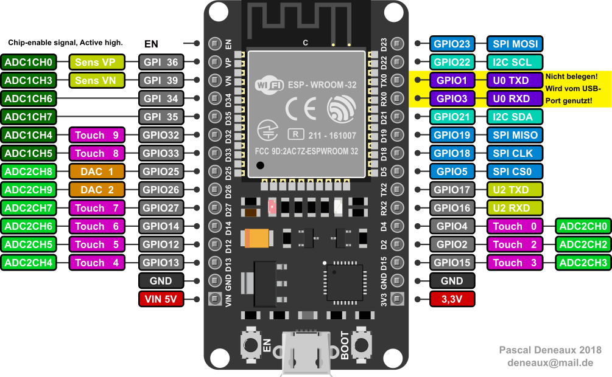

# Upsy Desky

Just like <https://github.com/tjhorner/upsy-desky>, but with a `DOIT esp32 DevKit v1`, an added temperature sensor and some not-so-beautiful wiring ;-).

* [Upsy Desky](#upsy-desky)
  * [Iterations](#iterations)
  * [Changes to upstream](#changes-to-upstream)
  * [How To...](#how-to)
    * [Set up a development environment?](#set-up-a-development-environment)
    * [Connect to upsy-desky the very first time?](#connect-to-upsy-desky-the-very-first-time)
    * [Change initial settings?](#change-initial-settings)
    * [Perform an upgrade? (e.g., after incorporating upstream changes)](#perform-an-upgrade-eg-after-incorporating-upstream-changes)
  * [Upstream](#upstream)
  * [Wiring](#wiring)
  * [Additional Documentation](#additional-documentation)
  * [Licenses](#licenses)
  * [References](#references)

## Iterations

1. Initially I forked <https://github.com/tjhorner/jarvis-desk> to <https://github.com/shadow1runner/jarvis-desk>; I wired everything as stipulated there, but was not really successful (most likely I had some wires wrong or did some wrong code modifications); anyway, doing more research let to...
2. ... <https://github.com/shadow1runner/FullyJarvis> which in comparison to the former uses one logic shifter less since only the UART connectivity is required; this did work fine, except for the fact that - no matter what I tried changing in code - the screen of the handset never turned off again, and it was the mere fact of not understanding the why which led to
3. ... the current iteration which is, again based on 1. (and what you are reading currently); doing it the second time was way smoother, already having gained more experience didn't hurt either ;-)

## Changes to upstream

This fork has rather small adjustments from the great upstream repo <https://github.com/tjhorner/upsy-desky> (also: cf. commit history):

* I had a `DOIT esp32 DevKit v1` at hand, which also features an `ESP32-WROOM-32` (just as upstream does), but:
  * it has voltage regulators from 5V to 3.3 V already built-in
  * can be powered from 5V (provided by the desk) via its `VIN` pin [1]
* thus, there was no need of having:
  * the `CP2102N` USB/UART adapter
  * the USB-C receptacle
  * 3V3 voltage regulator
* changed the default units to metric units as per SI standard
* changed the GPIO pins based on the PinOut shown below



In comparison to the upstream pinout:


| RJ45 Pin [^0] | Color LAN cable | Schematic Name | *Upstream* ESP32 mapped Pin | *New* DOIT esp32 DevKit v1 GPIO Pin | *My* wire color to esp32 | Note              |
| ------------- | --------------- | -------------- | --------------------------- | ----------------------------------- | ------------------------ | ----------------- |
| 1             | orange/white    | `DESK_1`       | `18`                        | `GPIO32`                            | blue                     | `button_m_pin`    |
| 2             | orange          | `DESK_2`       | `17`                        | `GPIO16` (`RX2`)                    | white                    | UART RX[^1], 5V   |
| 3             | green/white     | GND            | N/A (GND)                   | N/A (GND)                           |                          |                   |
| 4             | blue            | `DESK_4`       | `16`                        | `GPIO17` (`TX2`)                    | gray                     | UART TX[^1], 5V   |
| 5             | blue/white      | +5V            | N/A (+5V)                   | N/A (+5V)                           |                          |                   |
| 6             | green           | `DESK_6`       | `19`                        | `GPIO33`                            | green                    | `button_bit4_pin` |
| 7             | brown/white     | `DESK_7`       | `21`                        | `GPIO25`                            | yellow                   | `button_bit1_pin` |
| 8             | brown           | `DESK_8`       | `22`                        | `GPIO26`                            | purple                   | `button_bit2_pin` |

[^0]


[^1]
Note: The UART mappings are exchanged in comparison to upstream:

* the original did the swapping during the final mapping to the IC
* this one does it as part of the logic level shifters
* upstream:
  * uart.tx_pin: `16`
  * standing_desk_uart_rx_pin: `17`
* local:
  * standing_desk_uart_tx_pin: `GPIO17`
  * standing_desk_uart_rx_pin: `GPIO16`

Thus:

* `GPIO17` (UART2TX) is mapped to the `DESK_4` (RX) port (upstream: `16` -> `DESK_4`)
* `GPIO16` (UART2RX) is mapped to the `DESK_2` (TX) port (upstream: `17` -> `DESK_2`)

## How To...

### Set up a development environment?

* As usual: DON'T try getting it running on Windows, just get a Linux somewhere (e.g., a Raspberry) and you are good to go via running [setup.sh](tools/setup.sh)
* useful commands, after `cd firmware`:
  * `esphome run jarvis_withsecrets.yaml` compiles and flashes the firmware to the board; note that you shortly need to press its `BOOT` button such that the flashing can happen
    > Note: this requires `firmware/secrets.yaml` (not committed to remote), it should look as follows:

      ```yaml
      wifi_ssid: TODO1
      wifi_password: TODO2
      ```

  * `esphome run debug.yaml` in case you need more information
  * `esphome logs debug.yaml` for connecting to `LOGGER` (UART0)

### Connect to upsy-desky the very first time?

* `fully-jarvis` is configured to auto-reconnect to known WiFi networks; in case this fails, it goes into AP mode and spawns a network named `fully-jarvis`
* connect to said WiFi, using the initial password `Einstieg00`
* once there, it asks you to join a "real" WiFi, simply select one from the list and enter the password
* `fully-jarvis` will reboot and (try to) connect to known WiFi networks

### Change initial settings?

* after connecting to a known WiFi network (cf. [Connect to upsy-desky the very first time?](#connect-to-upsy-desky-the-very-first-time)), you should be able to connect via <http://fully-jarvis.local/>
* otherwise check your home network for a the IP address of a device named `fully-jarvis`
* there you can change settings (like units etc.)
* make sure to press the `Upsy Desky Restart` button once done such that the settings are persisted in flash and take effect

### Perform an upgrade? (e.g., after incorporating upstream changes)

* Rebase and push changes to `origin`
  > Note: `pip install --upgrade esphome` might be worthwhile in case you haven't fiddled with esphome for a while
* now either:
  * On gitHub:
    * [start a new release](https://docs.github.com/en/repositories/releasing-projects-on-github/managing-releases-in-a-repository) which will cause the CI pipeline to create a new firmware
    * download the release binaries, the `firmware.bin` is the file you need
    * navigate to your upsy-desky via a browser and upload said binaries which will perform an OTA upgrade
  * On your local development environment:
    * run `esphome run jarvis_withsecrets.yaml`, which compiles and flashes the firmware to the board; note that you shortly need to press its `BOOT` button such that the flashing can happen

## Upstream

* For any further information see upstream <https://github.com/tjhorner/upsy-desky/>

## Wiring

Cf. schematics folder

## Additional Documentation

You can find everything you need in the [GitHub wiki](https://github.com/tjhorner/upsy-desky/wiki/Getting-Started).

## Licenses

The ESPHome configs are licensed under MIT; everything else (enclosure and PCB design) are CC BY-NC-SA 4.0. The appropriate license files are available in the root of the repo.

## References

[1] PinOut and schematics of DOIT ESP32 Devkit V1: <https://github.com/SmartArduino/SZDOITWiKi/wiki/ESP8266---ESP32>
